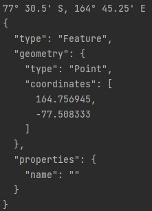
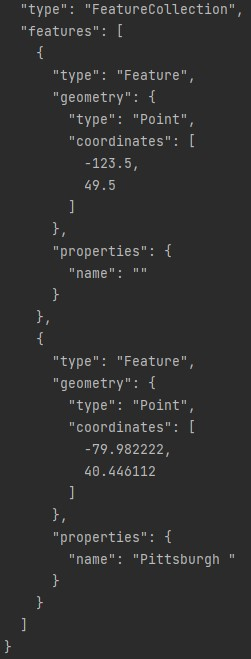

# Coordinate Converter
A program which converts a variety of coordinates in different formats to a standard [GeoJSON](https://en.wikipedia.org/wiki/GeoJSON) format.

GeoJson is a way to represent coordinates in a JSON format which can be read by humans and machines alike. This application can take coordinates in a variety of formats and converts them to a feature list. To test the output, use the generated geoJSON in https://geojson.io/.

The application can recognise a variety of inputs like:
* Degree decimal format with varying decimal lengths.
* Missing commas.
* Characters like N or S (which represent latitude) and E or W (which represent longitude) and possibly in the wrong order.
* "Degree, minute, seconds" form with or without decimal places on the seconds, and with or without the standard markers for degree, minutes, and seconds.
* Degree and decimal minutes form.
* symbols like `d`, `m`, `s`, `:` `'`, `"`, and `°` can be used as syntax.

## Formats supported

Examples:

    402646302N 0795855903W

    40:26:46.302N 079:58:55.903W

    40°26′46″N 079°58′56″W

    40d 26′ 46″ N 079d 58′ 56″ W

    40.446195N 79.982195W

    40.446195, -79.982195

    40.446195,-79.982195

    40° 26.7717, -79° 58.93172

    N40:26:46.302 W079:58:55.903

    N40°26′46″ W079°58′56″

    N40d 26′ 46″ W079d 58′ 56″

    N40.446195 W79.982195

## Examples

`77° 30.5' S, 164° 45.25' E`

---

`49d30.0m,-123d30.0'`

`40° 26′ 46″ N 79° 58′ 56″ W Pittsburgh`

## How to Run

In a linux terminal with all files in one directory:

`Javac -cp gson-2.9.0.jar *.java`

`Java -cp .:./gson-2.9.0.jar CoordinateJSONConverter`

ctrl+d to terminate application and print out the geoJSON encoded coordinates.

## Explanation

**Degree decimal** format is two numbers. The first represents latitude which is a value between -90.000000 and 90.000000 with positive values representing locations in the northern hemisphere and negative values, locations the southern hemisphere. The second value represents longitude with values between -180.000000 and 180.000000. Positive representing the eastern hemisphere (east of the prime meridian) and negative ones denoting locations in the western hemisphere. An optional label can be added at the end of a coordinate. For example: `45.9 S, 170.5 E Dunedin`.

**Degree, minutes, and seconds** format is the classical way of representing coordinates before computers. The first value is the degree and the second and third is minutes and second which acts as a precision for the degree. One degree is equal to 60 minutes and equal to 3600 seconds, for example: `70° 60' 3600"` = `72°`.

**Degree decimal minutes** is similar to DMS but instead of seconds, the minute value holds the precision and has can have decimal places for extra precision. For example: `70° 30.0` = `70.5°`

